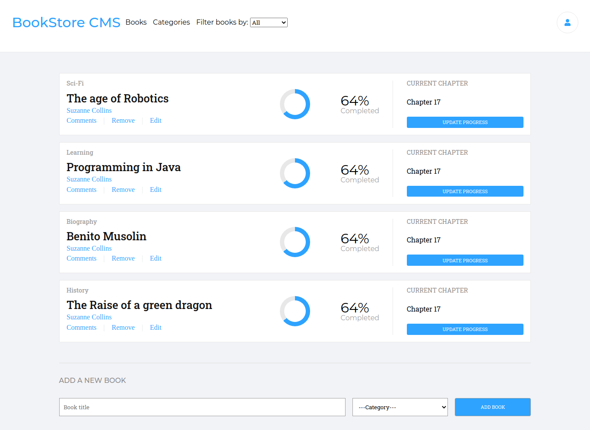

# Bookstore

> A simple bookstore management with React/Redux

I developed this project as it was a required project in Microverse's React/Redux course. It deals with simple bookstore management using redux state management. With it, you can create a book, you see all available books, and you can remove a  book from the store. I used SASS to style it.

## Built With

- React/Redux
- SASS

## Live Demo

[Live Demo Link](https://descholar-bookstore-react.herokuapp.com/)

## Getting Started

To get a local copy up and running follow these simple example steps.

### Prerequisites
- [Node.js](https://nodejs.org/en/) Installed on your local computer

### Install
1. Clone this Repository by running `git clone https://github.com/descholar-ceo/bookstore-react` and `cd bookstore-react`
2. Run `yarn` or `npm install` :point_right: to install all needed dependencies
### Usage
Run `yarn start` or `npm start`, the development server will start and the browser windows should get opened automatically, otherwise go on your browser and type `localhost:3000`, there you go
### Run tests
No tests yet
### Deployment
This app is deployed to [heroku](https://descholar-bookstore-react.herokuapp.com/)

## Authors

👤 **Author1**

- GitHub: [@Mugirase Emmanuel](https://github.com/descholar-ceo)
- Twitter: [@Mugirase Emmanuel](https://twitter.com/descholar3)
- LinkedIn: [Mugirase Emmanuel](https://linkedin.com/in/mugirase-emmanuel)

## 🤝 Contributing

Contributions, issues, and feature requests are welcome!

Feel free to check the [issues page](https://github.com/descholar-ceo/bookstore-react/issues).

## Show your support

Give it a :star: if you like this project!

## Acknowledgments

[Microverse](https://www.microverse.org/)
